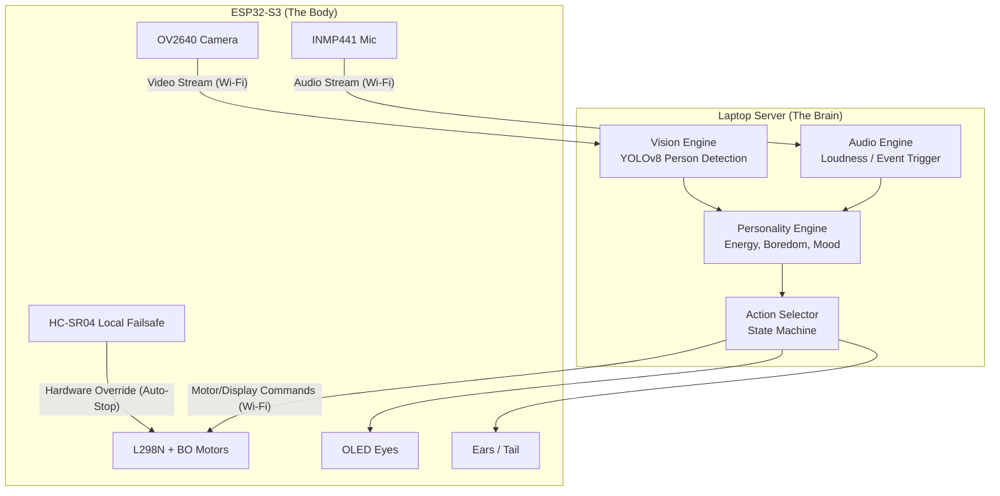
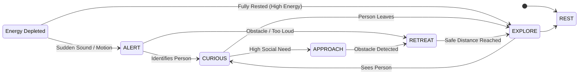

# Autonomous E-Pet Project Plan

This document outlines the architecture and step-by-step roadmap for building an autonomous, LLM-free electronic pet using your ESP32-S3 CAM and laptop server.

## 1. System Architecture

The robot operates on a "Brain / Body" split. The ESP32 handles reflexes and senses, while the laptop handles thinking and feeling.

> [!TIP] 
> **Why this split?** Streaming raw data to a PC keeps the robot lightweight and battery-efficient, while unlocking the massive compute power of your GTX 1050 for complex, fast vision processing without the latency of cloud LLMs.

## 2. Personality & Behavior State Machine

Instead of an LLM generating text, the pet uses a **Finite State Machine** combined with internal "needs" (Energy, Boredom, Social) to decide what to do. This makes it feel alive and unpredictable.

* **Internal Variables (Utility AI):**
  * `Energy`: Decays while moving/alert. Regenerates while resting.
  * `Boredom`: Increases over time if nothing happens. Triggers `EXPLORE` state.
  * `Social`: Increases when interacting with a person. Triggers tail wags, OLED happy eyes, and `APPROACH` state.

## 3. Development Roadmap

We will build this iteratively, adding one "sense" at a time to isolate bugs.

### Phase 1: The "Spinal Cord" (Hardware & Telemetry)
* **Goal:** A remote-controlled rover with a local safety reflex.
* **Tasks:**
  * Wire the 2S battery pack to the L298N and LM2596 buck converter (tuned to 5.0V).
  * Wire the BO motors to the L298N.
  * Wire one front HC-SR04 ultrasonic sensor (using the logic level converter).
  * Write ESP32 firmware to accept basic forward/back/left/right commands over Wi-Fi (WebSocket).
  * **Local Reflex:** Program the ESP32 to immediately stop the motors if the HC-SR04 detects an object < 10cm away or if Wi-Fi drops for > 0.5s.

### Phase 2: Sight & Server Setup
* **Goal:** The laptop can see what the robot sees.
* **Tasks:**
  * Wire the OV2640 camera to the ESP32.
  * Add video streaming to the ESP32 firmware (JPEG stream at 320x240 to save bandwidth).
  * Create the Python FastAPI server on the laptop.
  * Integrate OpenCV and YOLOv8-nano to draw bounding boxes around people in the video feed.

### Phase 3: The "Personality Engine" (Autonomy)
* **Goal:** The robot decides where to drive on its own.
* **Tasks:**
  * Implement the Behavior State Machine in Python (tracking Energy, Mood, etc.).
  * Map YOLOv8 outputs to the state machine (e.g., if Person bounding box gets bigger -> person is approaching -> trigger Curious).
  * Send automated drive commands from Python back to the ESP32.

### Phase 4: Expression (Servos & Eyes)
* **Goal:** Make it look like a pet.
* **Tasks:**
  * Wire the 1.3" OLED and servo(s).
  * Program different eye animations (Sleepy, Happy, Angry, Looking Left/Right) on the OLED.
  * Tie OLED animations and servo movements (e.g., ear twitches, tail wags) to the Python state machine.

### Phase 5: Hearing (Audio)
* **Goal:** React to sound events.
* **Tasks:**
  * Wire the INMP441 mic.
  * Stream audio packets from ESP32 to Python.
  * Use Python to detect volume spikes (sudden loud noises) to trigger the `ALERT` state.
  * (Optional) Play pet sounds from the laptop speakers when states change.
